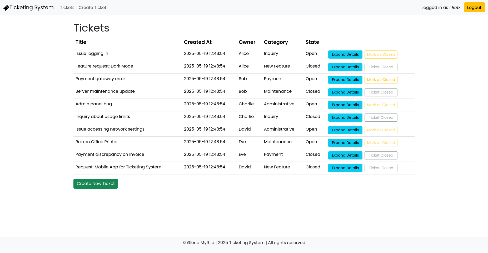

# Ticketing System Web Application

A modern web-based ticketing system that allows visitors to view tickets and authenticated users to create, update, and manage tickets. The system supports additional text blocks for each ticket, and provides administrative functionalities for managing ticket state and categories.

## Table of Contents

- [Features](#features)
- [Architecture and Tools](#architecture-and-tools)
- [Installation](#installation)
- [Usage](#usage)
- [Database Schema and Sample Data](#database-schema-and-sample-data)
- [Future Enhancements](#future-enhancements)
- [License](#license)

## Features

- **Ticket Overview:**  
  - Displays a list of all tickets (viewable by any user) with details including title, timestamp (formatted as YYYY-MM-DD HH:mm:ss), owner, category, and state (open or closed).  
  - The tickets are automatically sorted with the most recent ones first.

- **Ticket Creation:**  
  - Authenticated users can submit new tickets by entering the category, title, and an initial block of text.  
  - On submission, the ticket is automatically assigned a state ("open"), a timestamp, and the owner is set to the logged-in user.
  - A confirmation page is displayed prior to final submission, allowing users to review their ticket details.

- **Ticket Details and Responses:**  
  - Authenticated users can expand a ticket to see all text blocks (initial description and additional responses) in chronological order.
  - Additional blocks of text may be added by any authenticated user (except to closed tickets). Each additional block is stored with its own timestamp and the author's details.
  - The system preserves text formatting (such as newlines and HTML tags) for readability.

- **Ticket State Management:**  
  - Ticket owners can mark their tickets as closed, which prevents further responses.
  - Administrators have additional privileges including closing any ticket, reopening closed tickets, and changing ticket categories.

## Architecture and Tools

The application integrates several modern web technologies and libraries:

- **Frontend:**  
  - **React:** JavaScript library used for building the user interface.  
  - **React Router:** For client-side routing, enabling a multi-page experience without a full page reload.  
  - **React Bootstrap:** A UI kit for creating responsive, mobile-first components.  
  - **Day.js:** For formatting timestamps in a human-readable format.

- **Backend:**  
  - **Node.js & Express:** A server-side platform for building the REST API that handles ticket management.  
  - **SQLite:** A lightweight file-based relational database used to store users, tickets, and text blocks.  

- **Other Tools:**  
  - **Git:** For version control.  
  - **npm:** Package managers for installing dependencies.
  
## Installation

1. **Clone the Repository**
   ```bash
   git clone https://github.com/yourusername/ticketing-system.git
   cd ticketing-system
2. **For the frontend**
    ```bash
    cd client
    npm install
    npm run dev
3. **For the backend**
    ```bash
    cd ../server
    npm install
    nodemon index.js

## Screenshots

**Administrator Ticket List (with an expanded ticket):**  


**New Ticket Submission Form:**


**User Ticket List**  


**Log In Form:**  


## Test User Credentials

- **Admin Users:**
  - **Alice**  
    Email: `alice@example.com`  
    Password: `pwd`
  - **Charlie**  
    Email: `charlie@example.com`  
    Password: `pwd`

- **Regular Users:**
  - **Bob**  
    Email: `bob@example.com`  
    Password: `pwd`
  - **David**  
    Email: `david@example.com`  
    Password: `pwd`
  - **Eve**  
    Email: `eve@example.com`  
    Password: `pwd`